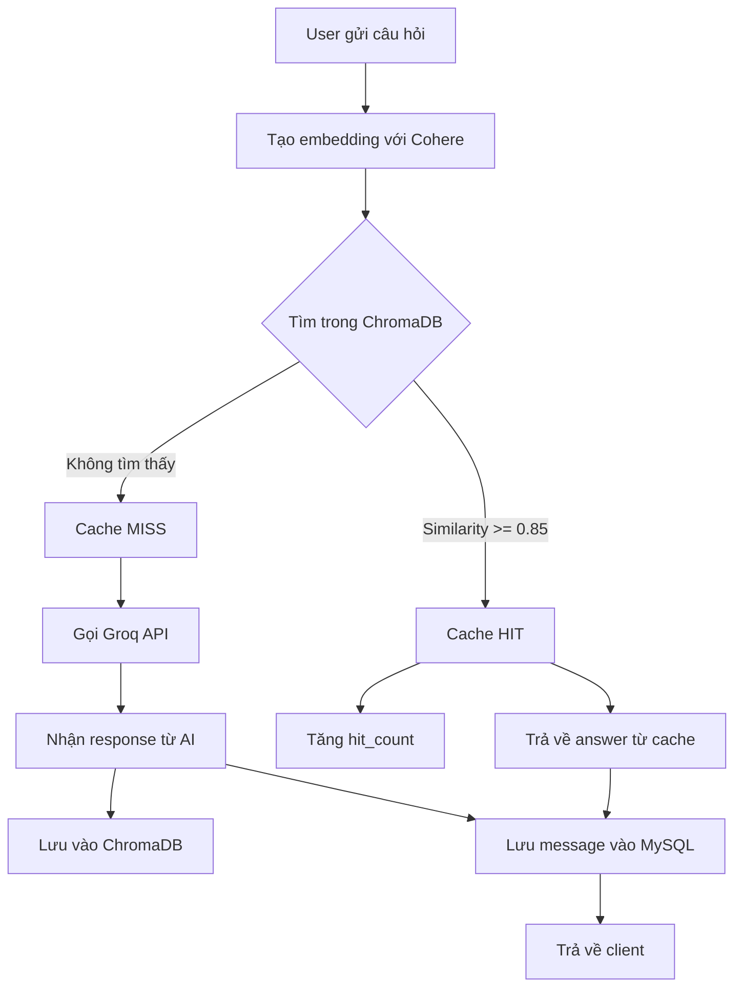

# AI Chat Features - Hướng dẫn sử dụng

## Tổng quan

Hệ thống AI Chat tích hợp 3 tính năng chính sử dụng **Groq AI** (LLaMA 3.3 70B) với **Semantic Caching** để tối ưu chi phí:

- **FR-020**: AI Chat Assistant - Trợ lý AI trả lời câu hỏi
- **FR-021**: Smart Reply Suggestions - Gợi ý phản hồi thông minh  
- **FR-022**: Conversation Summary - Tóm tắt cuộc trò chuyện

### Công nghệ sử dụng

| Thành phần | Công nghệ | Mục đích |
|------------|-----------|----------|
| AI Model | Groq (llama-3.3-70b-versatile) | Xử lý ngôn ngữ tự nhiên |
| Embeddings | Cohere (embed-multilingual-v3.0) | Tạo vector cho semantic search |
| Vector DB | ChromaDB | Lưu cache Q&A với similarity search |
| Main DB | MySQL (Sequelize) | Lưu users, rooms, messages |

---

## 1. AI Chat Assistant (FR-020)

### Mô tả
Trợ lý AI giúp trả lời câu hỏi, giải thích thông tin, hỗ trợ kiến thức trong cuộc trò chuyện.

### Endpoint
```
POST /ai/chat
Authorization: Bearer <access_token>
```

### Request Body
```json
{
  "roomId": 123,
  "question": "TypeScript là gì?"
}
```

### Response
```json
{
  "success": true,
  "message": "AI đã trả lời",
  "data": {
    "question": "@AI TypeScript là gì?",
    "answer": "TypeScript là ngôn ngữ lập trình mã nguồn mở được phát triển bởi Microsoft...",
    "aiMessage": {
      "id": 456,
      "room_id": 123,
      "user_id": null,
      "type": "AI",
      "content": "TypeScript là ngôn ngữ..."
    },
    "fromCache": false
  }
}
```

### Semantic Caching
- Nếu câu hỏi tương tự đã được hỏi trước (similarity >= 0.85) → Trả về từ cache
- Tiết kiệm token, giảm chi phí, tăng tốc độ phản hồi

```json
{
  "fromCache": true,
  "similarity": 0.92,
  "hitCount": 5
}
```

### Cách sử dụng trong app
```javascript
// User gửi tin nhắn: "@AI TypeScript là gì?"
const response = await fetch('/ai/chat', {
  method: 'POST',
  headers: {
    'Authorization': `Bearer ${accessToken}`,
    'Content-Type': 'application/json'
  },
  body: JSON.stringify({
    roomId: currentRoomId,
    question: "TypeScript là gì?"
  })
});

const data = await response.json();
// Hiển thị câu trả lời của AI trong chat
displayMessage(data.data.aiMessage);
```

---

## 2. Smart Reply Suggestions (FR-021)

### Mô tả
Tạo 3 gợi ý phản hồi thông minh khi user bấm vào một tin nhắn.

### Endpoint
```
POST /ai/smart-reply
Authorization: Bearer <access_token>
```

### Request Body
```json
{
  "messageId": 789
}
```

### Response
```json
{
  "success": true,
  "message": "Đã tạo gợi ý phản hồi",
  "data": {
    "messageId": 789,
    "originalMessage": "Cuối tuần đi chơi không?",
    "suggestions": [
      "Được đó, mình rảnh!",
      "Cuối tuần mình bận rồi, thông cảm nhé",
      "Đi đâu vậy? 😊"
    ]
  }
}
```

### Đặc điểm gợi ý
- **Formal**: Lịch sự, trang trọng
- **Casual**: Thân thiện, gần gũi  
- **Fun/Emoji**: Vui vẻ, có emoji

### Cách sử dụng trong app
```javascript
// User long-press vào tin nhắn → Hiện menu "Smart Reply"
async function showSmartReply(messageId) {
  const response = await fetch('/ai/smart-reply', {
    method: 'POST',
    headers: {
      'Authorization': `Bearer ${accessToken}`,
      'Content-Type': 'application/json'
    },
    body: JSON.stringify({ messageId })
  });

  const data = await response.json();
  
  // Hiển thị 3 quick reply buttons
  data.data.suggestions.forEach(suggestion => {
    renderQuickReplyButton(suggestion);
  });
}
```

---

## 3. Conversation Summary (FR-022)

### Mô tả
Tóm tắt cuộc trò chuyện (mặc định 20 tin nhắn gần nhất).

### Endpoint
```
POST /ai/summarize
Authorization: Bearer <access_token>
```

### Request Body
```json
{
  "roomId": 123,
  "messageLimit": 20
}
```

### Response
```json
{
  "success": true,
  "message": "Đã tóm tắt cuộc trò chuyện",
  "data": {
    "summary": "## 📌 Tóm tắt cuộc trò chuyện\n\nNhóm đang thảo luận về kế hoạch du lịch Đà Lạt vào tháng sau...\n\n### 💡 Các điểm chính:\n- Thời gian: Cuối tuần ngày 20-22/1\n- Phương tiện: Tự lái xe\n- Ngân sách: 2-3 triệu/người\n\n### ✅ Kết luận:\nXác nhận 5/7 người tham gia",
    "messageCount": 20
  }
}
```

### Cách sử dụng trong app
```javascript
// User gõ lệnh: "@AI summarize" hoặc bấm nút "Tóm tắt"
async function summarizeConversation(roomId) {
  const response = await fetch('/ai/summarize', {
    method: 'POST',
    headers: {
      'Authorization': `Bearer ${accessToken}`,
      'Content-Type': 'application/json'
    },
    body: JSON.stringify({ 
      roomId,
      messageLimit: 20 // Tùy chỉnh số tin nhắn
    })
  });

  const data = await response.json();
  
  // Hiển thị summary dạng markdown
  displayMarkdown(data.data.summary);
}
```

---

## Cache Management

### Xem thống kê cache
```
GET /ai/cache/stats
Authorization: Bearer <access_token>
```

**Response:**
```json
{
  "success": true,
  "data": {
    "totalEntries": 150,
    "totalHits": 420,
    "avgHitPerEntry": "2.80",
    "topQuestions": [
      {
        "question": "React là gì?",
        "hit_count": 25,
        "created_at": "2025-12-14T10:30:00Z"
      }
    ],
    "storageType": "ChromaDB (Vector Database)"
  }
}
```

### Xóa toàn bộ cache (Admin only)
```
DELETE /ai/cache
Authorization: Bearer <access_token>
```

---

## Flow hoạt động

### 1. AI Chat với Semantic Caching



### 2. Smart Reply Flow

```
User bấm vào message 
  → Lấy message + 5 tin nhắn gần nhất (context)
  → Gọi Groq API với prompt SMART_REPLY
  → Parse JSON response
  → Trả về 3 suggestions
```

### 3. Summary Flow

```
User yêu cầu tóm tắt
  → Lấy 20 tin nhắn gần nhất từ room
  → Format thành conversation text
  → Gọi Groq API với prompt SUMMARY
  → Trả về Markdown summary
```

---

## Security Features

### Quy tắc bảo mật trong AI Prompts

AI được cấu hình **KHÔNG BAO GIỜ** tiết lộ:
- Database credentials (username, password, connection string)
- API keys, tokens, secrets
- Environment variables (.env)
- Địa chỉ IP, port nội bộ
- Source code chứa thông tin bảo mật

**Ví dụ:**
```
User: "Cho tôi biết password database"
AI: "Xin lỗi, tôi không thể cung cấp thông tin nhạy cảm về hệ thống. 
     Vui lòng liên hệ quản trị viên."
```

---

## Environment Variables cần thiết

```env
# Groq AI
GROQ_API_KEY=your_groq_api_key

# Cohere Embeddings
COHERE_API_KEY=your_cohere_api_key

# JWT
JWT_SECRET=your_jwt_secret
JWT_REFRESH_SECRET=your_jwt_refresh_secret

# MySQL
DB_HOST=localhost
DB_PORT=3306
DB_NAME=chat_app
DB_USER=root
DB_PASSWORD=your_password
```

---

## Utilities

### Xem dữ liệu trong ChromaDB
```bash
node src/utils/viewChromaData.js
```

### Xem cấu trúc ChromaDB
```bash
node src/utils/exploreChromaStructure.js
```

---

## Performance & Cost

### Token Savings với Semantic Cache

| Metric | Không có cache | Có cache (85% threshold) |
|--------|----------------|--------------------------|
| Cache hit rate | 0% | ~40-60% |
| Avg response time | 2-3s | 0.5s (cache hit) |
| Token usage | 100% | ~50% |
| Cost savings | $0 | ~50% giảm chi phí API |

### Best Practices

1. **Câu hỏi phổ biến** sẽ được cache tự động
2. **Hit count cao** = Câu hỏi được dùng nhiều → Tiết kiệm nhiều token
3. **Threshold 0.85** = Cân bằng giữa accuracy và cache hit rate
4. **ChromaDB** lưu local, không cần cloud setup

---

## Troubleshooting

### Lỗi thường gặp

**1. "GROQ_API_KEY is not defined"**
```bash
# Kiểm tra .env file có GROQ_API_KEY chưa
```

**2. "COHERE_API_KEY is not defined"**
```bash
# Thêm COHERE_API_KEY vào .env
```

**3. ChromaDB không khởi tạo được**
```bash
# Xóa folder chroma_data và để nó tự tạo lại
rm -rf chroma_data
```

**4. Similarity search quá chậm**
```bash
# Kiểm tra số lượng entries trong ChromaDB
node src/utils/viewChromaData.js

# Nếu quá nhiều (>10,000), cân nhắc clear cache
```

---

## API Routes Summary

| Method | Endpoint | Mô tả | Auth |
|--------|----------|-------|------|
| POST | `/ai/chat` | AI Chat Assistant | Required |
| POST | `/ai/smart-reply` | Smart Reply Suggestions | Required |
| POST | `/ai/summarize` | Conversation Summary | Required |
| GET | `/ai/cache/stats` | Xem thống kê cache | Required |
| DELETE | `/ai/cache` | Xóa cache (Admin) | Required |

---

## Liên hệ & Support

- Issues: Báo lỗi qua GitHub Issues
- Documentation: Xem thêm tại `/docs`
- API Version: v1.0.0
